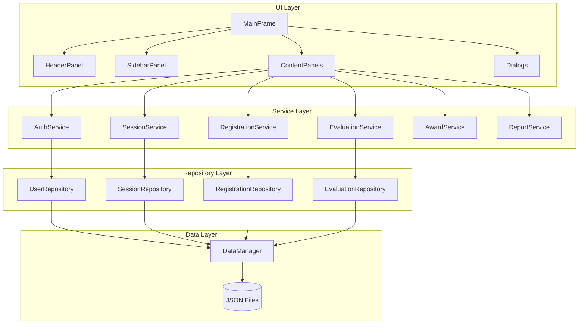

# Design Document

## Overview

Seminar Management System (SMS) 是一个基于 Java Swing 的桌面应用程序，采用 MVC 架构模式，实现 FCI 学院研究生学术研讨会的完整管理功能。系统支持四种角色（Guest、Student、Evaluator、Coordinator），提供研讨会日程管理、学生注册、评估、奖项计算和报告生成等核心功能。

### Key Design Goals

1. **角色分离**: 严格的 RBAC 权限控制
2. **用户体验**: 学术风格、专业简洁的现代化界面
3. **数据完整性**: 可靠的 JSON 文件持久化
4. **可维护性**: 清晰的分层架构和模块化设计

## Architecture

系统采用经典的三层 MVC 架构：

```
┌─────────────────────────────────────────────────────────────┐
│                      Presentation Layer                      │
│  ┌─────────────┐  ┌─────────────┐  ┌─────────────────────┐  │
│  │  MainFrame  │  │   Dialogs   │  │   Panels (by role)  │  │
│  └─────────────┘  └─────────────┘  └─────────────────────┘  │
├─────────────────────────────────────────────────────────────┤
│                       Service Layer                          │
│  ┌───────────┐ ┌─────────────┐ ┌────────────┐ ┌──────────┐ │
│  │AuthService│ │SessionService│ │RegistrationService│ │...│ │
│  └───────────┘ └─────────────┘ └────────────┘ └──────────┘ │
├─────────────────────────────────────────────────────────────┤
│                      Repository Layer                        │
│  ┌──────────────┐ ┌─────────────────┐ ┌──────────────────┐  │
│  │UserRepository│ │SessionRepository│ │RegistrationRepo  │  │
│  └──────────────┘ └─────────────────┘ └──────────────────┘  │
├─────────────────────────────────────────────────────────────┤
│                       Data Layer                             │
│  ┌─────────────────────────────────────────────────────┐    │
│  │              JSON File Storage (DataManager)         │    │
│  └─────────────────────────────────────────────────────┘    │
└─────────────────────────────────────────────────────────────┘
```

### Architecture Diagram



## Components and Interfaces

### 1. Model Layer

#### Enums

```java
public enum Role {
    GUEST, STUDENT, EVALUATOR, COORDINATOR
}

public enum SessionStatus {
    OPEN, FULL, CLOSED, REQUIRES_APPROVAL
}

public enum SessionType {
    ORAL, POSTER
}

public enum RegistrationStatus {
    PENDING, APPROVED, REJECTED, CANCELLED
}

public enum AwardType {
    BEST_ORAL, BEST_POSTER, PEOPLES_CHOICE
}
```

#### Core Entities

```java
// User hierarchy
public abstract class User {
    Long id;
    String username;
    String password;
    String name;
    String email;
    Role role;
}

public class Student extends User {
    String studentId;
    String program;
    String supervisor;
}

public class Evaluator extends User {
    String department;
    String expertise;
}

public class Coordinator extends User {
    String staffId;
}

// Session entity
public class Session {
    Long id;
    LocalDate date;
    LocalTime startTime;
    LocalTime endTime;
    String venue;
    SessionType type;
    int capacity;
    int registered;
    SessionStatus status;
    String description;
}

// Registration entity
public class Registration {
    Long id;
    Long studentId;
    Long sessionId;
    String researchTitle;
    String abstractText;
    String supervisorName;
    SessionType presentationType;
    RegistrationStatus status;
    String filePath;
    LocalDateTime createdAt;
}

// Evaluation entity
public class Evaluation {
    Long id;
    Long evaluatorId;
    Long registrationId;
    int problemClarity;      // 0-25
    int methodology;         // 0-25
    int results;             // 0-25
    int presentationQuality; // 0-25
    String comments;
    boolean submitted;
    LocalDateTime submittedAt;
    
    int getTotalScore(); // returns sum of all criteria
}

// Award entity
public class Award {
    Long id;
    AwardType type;
    Long registrationId;
    double score;
    LocalDateTime awardedAt;
}
```

### 2. Service Layer Interfaces

```java
public interface IAuthService {
    boolean login(String username, String password, Role role);
    void logout();
    User getCurrentUser();
    Role getCurrentRole();
    boolean hasPermission(String permission);
}

public interface ISessionService {
    List<Session> getAllSessions();
    List<Session> getAvailableSessions(SessionType type);
    Session getSessionById(Long id);
    Session createSession(Session session);
    Session updateSession(Session session);
    void deleteSession(Long id);
    void updateSessionStatus(Long id, SessionStatus status);
}

public interface IRegistrationService {
    Registration register(Registration registration);
    Registration getRegistrationById(Long id);
    List<Registration> getRegistrationsByStudent(Long studentId);
    List<Registration> getRegistrationsBySession(Long sessionId);
    List<Registration> getPendingRegistrations();
    void approveRegistration(Long id);
    void rejectRegistration(Long id);
    void assignToSession(Long registrationId, Long sessionId);
}

public interface IEvaluationService {
    List<Evaluation> getEvaluationsByEvaluator(Long evaluatorId);
    List<Evaluation> getEvaluationsByRegistration(Long registrationId);
    Evaluation saveEvaluation(Evaluation evaluation);
    void submitEvaluation(Long evaluationId);
    void assignEvaluator(Long evaluatorId, Long registrationId);
    double getAverageScore(Long registrationId);
}

public interface IAwardService {
    List<Award> calculateAwards();
    Award getBestOral();
    Award getBestPoster();
    Award getPeoplesChoice();
}

public interface IReportService {
    Map<String, Object> getRegistrationStatistics();
    Map<String, Object> getEvaluationSummary();
    Map<String, Object> getSessionAttendance();
    void exportToCsv(String reportType, String filePath);
}
```

### 3. Repository Layer Interfaces

```java
public interface IRepository<T, ID> {
    T findById(ID id);
    List<T> findAll();
    T save(T entity);
    void delete(ID id);
}

public interface IUserRepository extends IRepository<User, Long> {
    User findByUsername(String username);
    List<User> findByRole(Role role);
}

public interface ISessionRepository extends IRepository<Session, Long> {
    List<Session> findByDate(LocalDate date);
    List<Session> findByType(SessionType type);
    List<Session> findByStatus(SessionStatus status);
}

public interface IRegistrationRepository extends IRepository<Registration, Long> {
    List<Registration> findByStudentId(Long studentId);
    List<Registration> findBySessionId(Long sessionId);
    List<Registration> findByStatus(RegistrationStatus status);
}

public interface IEvaluationRepository extends IRepository<Evaluation, Long> {
    List<Evaluation> findByEvaluatorId(Long evaluatorId);
    List<Evaluation> findByRegistrationId(Long registrationId);
}
```

### 4. UI Components

#### Main Frame Structure

```java
public class MainFrame extends JFrame {
    private HeaderPanel headerPanel;
    private SidebarPanel sidebarPanel;
    private JPanel contentPanel;
    private StatusBar statusBar;
    
    void switchPanel(JPanel panel);
    void updateForRole(Role role);
    void showLoginDialog();
    void logout();
}
```

#### Custom Components (from steering files)

- `StyledButton` - 带状态效果的按钮
- `StyledTextField` - 带占位符的输入框
- `StyledTable` - 斑马纹表格
- `RoundedPanel` - 圆角面板
- `CardPanel` - 卡片容器
- `StatusLabel` - 状态标签

## Data Models

### JSON Schema

#### users.json
```json
{
  "students": [
    {
      "id": 1,
      "username": "student1",
      "password": "hashed_password",
      "name": "张三",
      "email": "zhangsan@fci.edu",
      "studentId": "S2024001",
      "program": "计算机科学",
      "supervisor": "李教授"
    }
  ],
  "evaluators": [...],
  "coordinators": [...]
}
```

#### sessions.json
```json
{
  "sessions": [
    {
      "id": 1,
      "date": "2024-03-15",
      "startTime": "09:00",
      "endTime": "12:00",
      "venue": "会议室A",
      "type": "ORAL",
      "capacity": 20,
      "registered": 5,
      "status": "OPEN",
      "description": "上午口头报告场次"
    }
  ]
}
```

#### registrations.json
```json
{
  "registrations": [
    {
      "id": 1,
      "studentId": 1,
      "sessionId": 1,
      "researchTitle": "基于深度学习的图像识别研究",
      "abstractText": "本研究探讨...",
      "supervisorName": "李教授",
      "presentationType": "ORAL",
      "status": "APPROVED",
      "filePath": "uploads/presentation_1.pptx",
      "createdAt": "2024-03-01T10:30:00"
    }
  ]
}
```

#### evaluations.json
```json
{
  "evaluations": [
    {
      "id": 1,
      "evaluatorId": 1,
      "registrationId": 1,
      "problemClarity": 20,
      "methodology": 22,
      "results": 18,
      "presentationQuality": 23,
      "comments": "研究方法清晰，结果展示有待改进",
      "submitted": true,
      "submittedAt": "2024-03-15T14:30:00"
    }
  ]
}
```


## Correctness Properties

*A property is a characteristic or behavior that should hold true across all valid executions of a system-essentially, a formal statement about what the system should do. Properties serve as the bridge between human-readable specifications and machine-verifiable correctness guarantees.*

Based on the acceptance criteria analysis, the following correctness properties have been identified:

### Authentication Properties

**Property 1: Valid credentials authentication**
*For any* valid username, password, and role combination that exists in the user repository, authentication SHALL succeed and the current role SHALL be updated to match the authenticated user's role.
**Validates: Requirements 1.3**

**Property 2: Invalid credentials rejection**
*For any* username, password, or role combination that does not match an existing user, authentication SHALL fail and the current session state (role and user) SHALL remain unchanged.
**Validates: Requirements 1.4**

**Property 3: Logout role reset**
*For any* authenticated user (Student, Evaluator, or Coordinator), after logout the current role SHALL be Guest and the current user SHALL be null.
**Validates: Requirements 1.5**

### Session Display Properties

**Property 4: Complete session display**
*For any* session in the repository, when the schedule view is displayed, that session SHALL appear in the view with its status information visible.
**Validates: Requirements 2.1, 2.2**

**Property 5: Session filter correctness**
*For any* filter criteria (date or type), all sessions returned by the filter SHALL match the specified criteria, and no matching sessions SHALL be excluded.
**Validates: Requirements 2.3, 3.3**

### Registration Properties

**Property 6: Valid registration creates pending record**
*For any* registration submission with all required fields (research title, abstract, supervisor name, presentation type, session ID) populated, a registration record SHALL be created with status PENDING.
**Validates: Requirements 3.4**

**Property 7: Invalid registration rejection**
*For any* registration submission with one or more required fields empty or invalid (title > 200 chars, abstract > 1000 chars), the submission SHALL be rejected and no registration record SHALL be created.
**Validates: Requirements 3.5**

### File Upload Properties

**Property 8: File validation correctness**
*For any* file, if the file extension is in {.ppt, .pptx, .pdf, .png, .jpg} AND file size is ≤ 50MB, validation SHALL pass; otherwise validation SHALL fail.
**Validates: Requirements 4.2, 4.4**

**Property 9: Valid file association**
*For any* valid file uploaded by a student with an approved registration, the file SHALL be stored and the registration's filePath field SHALL be updated to reference the stored file.
**Validates: Requirements 4.3**

### Evaluation Properties

**Property 10: Evaluator assignment visibility**
*For any* evaluator, the list of presentations shown SHALL contain only presentations where an evaluation assignment exists for that evaluator, and SHALL contain all such assignments.
**Validates: Requirements 5.1**

**Property 11: Evaluation score invariant**
*For any* evaluation with scores (problemClarity, methodology, results, presentationQuality), the total score SHALL equal the sum of all four criteria scores, and each criterion SHALL be in range [0, 25].
**Validates: Requirements 5.3**

**Property 12: Draft save state preservation**
*For any* evaluation saved as draft, the submitted flag SHALL be false and submittedAt SHALL be null.
**Validates: Requirements 5.5**

**Property 13: Evaluation submission state**
*For any* evaluation that is submitted, the submitted flag SHALL be true and submittedAt SHALL be a non-null timestamp representing the submission time.
**Validates: Requirements 5.6**

### Session Management Properties

**Property 14: Session creation validation**
*For any* session creation request, if any required field (date, startTime, endTime, venue, type, capacity) is missing or invalid, the creation SHALL fail.
**Validates: Requirements 6.2**

**Property 15: Empty session deletion**
*For any* session with registered count equal to 0, deletion SHALL succeed and the session SHALL be removed from the repository.
**Validates: Requirements 6.4**

**Property 16: Non-empty session deletion protection**
*For any* session with registered count greater than 0, deletion SHALL require explicit confirmation before proceeding.
**Validates: Requirements 6.5**

### Assignment Properties

**Property 17: Assignment count increment**
*For any* student-to-session assignment, after the assignment the session's registered count SHALL be exactly one greater than before the assignment.
**Validates: Requirements 7.2**

**Property 18: Capacity status invariant**
*For any* session, if registered count equals capacity, the session status SHALL be FULL; if registered count is less than capacity and status was OPEN, it SHALL remain OPEN.
**Validates: Requirements 7.4**

### Award Properties

**Property 19: Award winner selection**
*For any* award category (ORAL or POSTER), the winner SHALL be the registration with the highest average evaluation score among all registrations of that presentation type.
**Validates: Requirements 8.2**

**Property 20: Tie handling**
*For any* award category where multiple registrations share the highest average score, all tied registrations SHALL be listed as co-winners.
**Validates: Requirements 8.4**

### UI Properties

**Property 21: Role-based menu visibility**
*For any* role, the sidebar menu SHALL display only menu items permitted for that role, and SHALL display all permitted items.
**Validates: Requirements 10.2**

**Property 22: Status color mapping**
*For any* status value, the displayed label SHALL use the correct color: SUCCESS (green) for positive states, WARNING (yellow) for pending states, DANGER (red) for negative states, INFO (blue) for informational states.
**Validates: Requirements 10.5**

### Data Persistence Properties

**Property 23: JSON serialization round-trip**
*For any* entity (User, Session, Registration, Evaluation), serializing to JSON and then deserializing SHALL produce an entity equal to the original.
**Validates: Requirements 11.1, 11.2**

## Error Handling

### Authentication Errors
- Invalid credentials: Display error message, clear password field, maintain form state
- Account locked: Display lockout message with remaining time
- Network/file error: Display system error message, log error details

### Validation Errors
- Missing required fields: Highlight fields with red border, show field-specific error messages
- Invalid data format: Show format requirements in tooltip
- Constraint violations: Display specific constraint that was violated

### File Operation Errors
- File too large: Display size limit message with current file size
- Invalid file type: Display allowed file types
- Upload failure: Retry option with error details
- Storage full: Display storage status and cleanup suggestions

### Data Persistence Errors
- JSON parse error: Log error, initialize with empty data, notify user
- File write error: Retry with exponential backoff, notify user on failure
- Data corruption: Attempt recovery from backup, notify user

### UI Error States
- Loading state: Show spinner with "Loading..." text
- Empty state: Show helpful message with action suggestions
- Error state: Show error icon with message and retry option

## Testing Strategy

### Testing Framework

The system will use **JUnit 5** for unit testing and **jqwik** for property-based testing in Java.

### Unit Testing Approach

Unit tests will cover:
1. **Service layer methods**: Test individual service operations with mocked repositories
2. **Repository operations**: Test CRUD operations with test data files
3. **Validation logic**: Test input validation with boundary values
4. **UI component behavior**: Test component state changes and event handling

Example unit test areas:
- AuthService.login() with valid/invalid credentials
- SessionService.createSession() with valid/invalid data
- RegistrationService.register() validation
- EvaluationService.calculateTotalScore()
- FileUtils.validateFile() with various file types/sizes

### Property-Based Testing Approach

Property-based tests will verify the correctness properties defined above. Each property test will:
1. Generate random valid inputs using jqwik generators
2. Execute the operation under test
3. Verify the property holds for all generated inputs
4. Run a minimum of 100 iterations per property

Each property-based test MUST be tagged with a comment in the format:
`**Feature: seminar-management-system, Property {number}: {property_text}**`

Example property test structure:
```java
@Property
// **Feature: seminar-management-system, Property 11: Evaluation score invariant**
void evaluationTotalScoreEqualsSum(
    @ForAll @IntRange(min = 0, max = 25) int clarity,
    @ForAll @IntRange(min = 0, max = 25) int methodology,
    @ForAll @IntRange(min = 0, max = 25) int results,
    @ForAll @IntRange(min = 0, max = 25) int quality
) {
    Evaluation eval = new Evaluation();
    eval.setProblemClarity(clarity);
    eval.setMethodology(methodology);
    eval.setResults(results);
    eval.setPresentationQuality(quality);
    
    assertThat(eval.getTotalScore())
        .isEqualTo(clarity + methodology + results + quality);
}
```

### Test Coverage Goals

- Service layer: 80% line coverage
- Repository layer: 90% line coverage
- Model validation: 100% of validation rules tested
- All 23 correctness properties covered by property-based tests

### Test Data Management

- Use separate test data files in `src/test/resources/data/`
- Reset test data before each test class
- Use builders for creating test entities with sensible defaults
